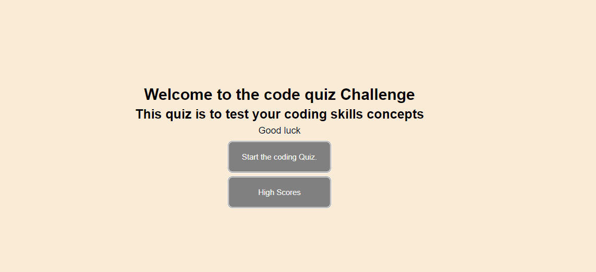

Name: Nikhil Kharbanda\
Project: Code Generator\
URL to project: https://nikhil-kharbanda.github.io/UofT_CodeQuiz/ \
Due: September 22, 2021 \

In this assignment, we were tasked to make a "Code Quiz" application from scratch. The goal of this assignment was to get a better understanding of javascript and how it can work with the HTML/CSS side of things

The user starts the quiz by clicking a button, a series of questions and options will appear. Once all the questions have been asked or the timer run out, they user can enter their initals and save their scores.

Checklist:\
[X] When the user clicks the start button, a timer start as well as a series of questions appear
[X] Once user answers a question, the next question appears
[X] When a user answers a question incorrectly, time is subtracted
[X] When timer reaches 0, or all questions have been answered, the user can save their score as well as enter their initals

Bonus: Since I have a lot of questions, I wanted to give the user a bonus 5 secs/correct answer

This screenshot is the first first the user is greeted by.