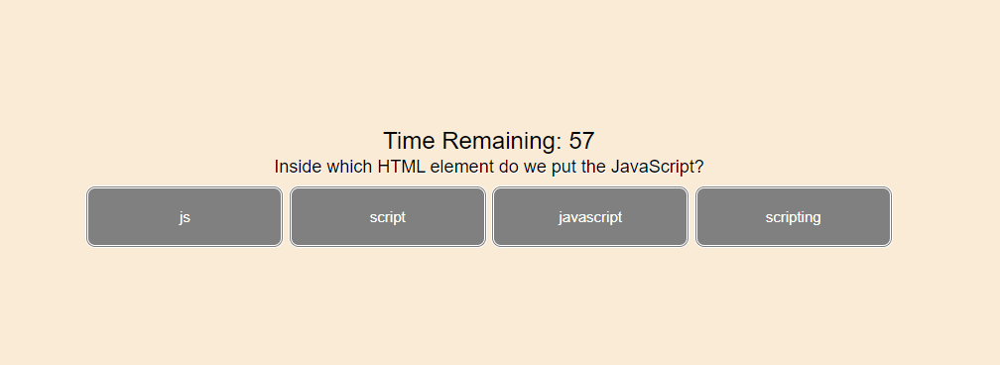

<h1 align="center">Code Quiz </h1>

    

## Description

In this assignment, we were tasked to make a "Code Quiz" application from scratch. The goal of this assignment was to get a better understanding of javascript and how it can work with the HTML/CSS side of things

The user starts the quiz by clicking a button, a series of questions and options will appear. Once all the questions have been asked or the timer run out, they user can enter their initals and save their scores.

## Table of Contents
  - [Description](#description)
  - [Installation](#installation)
  - [License](#license)
  - [Contributing](#contributing)
  - [Link](#Link)
  - [Images](#images)  

## Purpose
  To create a quiz based on coding syntaxes for HTML, CSS, and JS
  
## Installation

### Clone
  git clone https://github.com/nikhil-kharbanda/UofT_CodeQuiz.git

### Install Dependencies
Once cloned, and to run this application locally, right click on the "index.html" file and select "Open in new browser"

### Features
1. Users can look for a stock value and get real time updates
2. Users can look for a cryptocurrency value and see the different trends

## Contributing
  N/A

## Link
  https://nikhil-kharbanda.github.io/UofT_CodeQuiz/

## Images

  
This screenshot is the first screen the user is greeted by.

  
This screenshot is a sample question the webpage can ask.

  
This screenshot is when after the quiz is over, the user can see how they did and save their score

   
This screenshot is a sample of a table of records 
